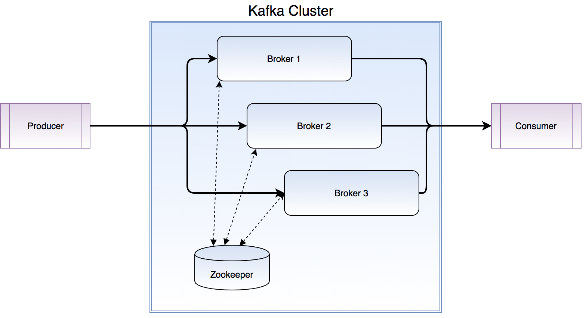

# Set up an embedded Apache Kafka testing server

As the exploding interests and development of AI aka machine Learning, this year’s Spark Summit has repositioned and emphasized on machine learning experience and many of its developing techniques.  In my exploration of deep learn with TensorFlow, we are starting a sequence of blogs to summarize the lessons, tricks and tips that we learned.  

## Introduction

Apache Kafka is a distributed streaming platform. It generally can be used for two broad classes of applications:
- Building real-time streaming data pipelines that reliably get data between systems and applications;
- Building real-time streaming applications that transform or react to the stream of data;

In order to try out Apache Kafka with other down-stream frameworks, such as Apache Spark or TensorFlow, developers usually have to set up a cluster using a few (virtual) machines or a single node in local mode. Instead of installing those components to run Apache Kafka, this document is to try to help you by providing a way to get an embedded Kafka cluster running on your local machine so that you can focus more on developing the down-stream applications.

## System Architecture

The Kafka cluster usually includes a few components:
- Zookeeper:  Which is a centralized service to maintain states between the nodes of the cluster, here we will use an embedded Zookeeper;
- Kafka brokers: Kafka brokers form the heart of the system, and act as the pipelines where our data is stored and distributed;
- Producers: Which publish data to the topics of their choice;
- Consumers: Which read data from the cluster;

## Starting Zookeeper

Zookeeper is the service that stores key-value to maintain server state. Kafka relies on Zookeeper to run, so the first task is to start a Zookeeper instance.

By leveraging another Apache project – Apache Curator, we can start a TestingServer provided by Curator. From its Javadoc, we should notice that TestingServer is FOR TESTING PURPOSES ONLY, but it will fit our need at this moment.

By creating an instance of TestingServer, we can easily make Zookeeper running embedded and get connection information from that server. 

Because certain version of Apache Curator only works with certain version of Zookeeper, you have to make sure you are using the proper version of Apache Curator. You can find the documentation of version compatibility here:

[https://curator.apache.org/zk-compatibility.html](https://curator.apache.org/zk-compatibility.html)

## Starting Kafka

Before we start Kafka server, we need to set up a minimum of configuration properties in order to run it, that includes host name, port, etc.

Kafka Test provides a very useful TestUtils class, which we can simply use it to create a Kafka server. Please note that usually you won’t be able to find Kafka Test in your release package, but for testing purpose, you can add it in by turning on the <classifier>test</classifier> in your pom.xml file.

With Kafka server running on your local machine in the embedded mode, you can start writing the codes to create topic and put some data into that. Later on, you can also stop the server and do some cleanup.

## Conclusion

Developers usually have to set a cluster to test out Apache Kafka and program the down-stream applications. By leveraging some other open source project and test utilities, we can avoid downloading and installing those components, thus speed up the development process and let us focus more on the applications.

All the codes can be found in my GitHub, here is the link:

[https://github.com/bomeng/embedded_kafka](https://github.com/bomeng/embedded_kafka)
